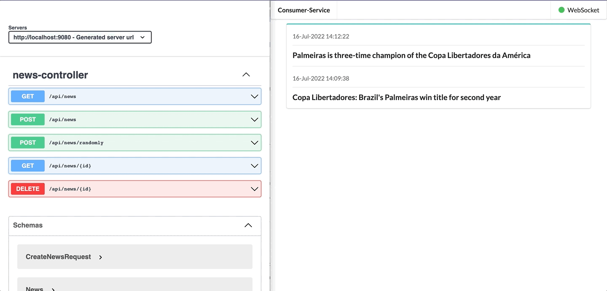

# springboot-aws-localstack-dynamodb-lambda-sns-sqs

In this project, we are going to use [`LocalStack`](https://localstack.cloud/) to simulate locally, some services provided by [`AWS Cloud`](https://aws.amazon.com/) such as: [`DynamoDB`](https://aws.amazon.com/dynamodb/), [`Lambda`](https://aws.amazon.com/lambda/), [`SNS`](https://aws.amazon.com/sns/) and [`SQS`](https://aws.amazon.com/sqs/).

## Project Architecture


## Applications

- ### producer-service

  [`Spring Boot`](https://docs.spring.io/spring-boot/docs/current/reference/htmlsingle/) Java Web application that exposes a REST API to manage news.

  It has the following endpoints:
  ```
     GET /api/news
     GET /api/news/{id}
    POST /api/news {"title": "..."}
  DELETE /api/news/{id}
  ```

- ### dynamodb-lambda-function

  [`Spring Cloud Function`](https://docs.spring.io/spring-cloud-function/docs/current/reference/html/spring-cloud-function.html) application that uses [`AWS Adapter`](https://docs.spring.io/spring-cloud-function/docs/current/reference/html/aws.html) to convert it to a form that can run in `AWS Lambda`.

  `dynamodb-lambda-function` listens to events emitted by an event-source created to monitor changes in `DynamoDB`. Once it receives an event, it processes it and publishes a new event to `SNS`.

- ### consumer-service

  `Spring Boot` Java Web application that consumes the events that `dynamodb-lambda-function` publishes to `SNS`. These events are queued in a `SQS`.

## Prerequisites

- [`Java 11+`](https://www.oracle.com/java/technologies/downloads/#java11)
- [`Docker`](https://www.docker.com/)
- [`Docker-Compose`](https://docs.docker.com/compose/install/)

## Package dynamodb-lambda-function jar

- In a terminal, make sure you inside `springboot-aws-localstack-dynamodb-lambda-sns-sqs` root folder

- Run the following script
  ```
  ./package-dynamodb-lambda-function-jar.sh
  ```
  When `Maven` packaging finishes, the jar file generated in `dynamodb-lambda-function/target` folder is copied to `dynamodb-lambda-function/shared` folder

## Start and Initialize LocalStack

- In a terminal, make sure you are in inside `springboot-aws-localstack-dynamodb-lambda-sns-sqs` root folder

- Start `LocalStack` Docker container
  ```
  DEBUG=1 docker-compose up
  ```
  > **Note:** Debug logs are enabled so that we have more insights about what is happening

- In a new terminal, initialize `LocalStack` by running the following script
  ```
  ./init-localstack.sh
  ```
  The script will create:
    - create `news-topic` in `SNS`;
    - create `news-consumer-service-queue` in `SQS`;
    - subscribe `news-consumer-service-queue` to `news-topic`; 
    - create `News` table in `DynamoDB`;
    - create `ProcessDynamoDBEvent` Lambda function;
    - create an `event-source-mapping` to connect `DynamoDB` to `ProcessDynamoDBEvent` Lambda function.

## Running applications with Maven

- **producer-service**

  - In a terminal, make sure you are inside `springboot-aws-localstack-dynamodb-lambda-sns-sqs` root folder
  - Run the following command to start the application
    ```
    ./mvnw clean spring-boot:run --projects producer-service -Dspring-boot.run.jvmArguments="-Daws.accessKey=key -Daws.secretAccessKey=secret"
    ```

- **consumer-service**

  - In a new terminal, navigate to `springboot-aws-localstack-dynamodb-lambda-sns-sqs` root folder
  - Run the command below to start the application
    ```
    ./mvnw clean spring-boot:run --projects consumer-service -Dspring-boot.run.jvmArguments="-Daws.accessKey=key -Daws.secretAccessKey=secret"
    ```

## Running applications as Docker container

- ### Build Docker images

  In a terminal and, inside `springboot-aws-localstack-dynamodb-lambda-sns-sqs` root folder, run the following script
  ```
  ./docker-build.sh
  ```

- ### Run Docker containers

  - **producer-service**
    
    In a terminal, run the following command
    ```
    docker run --rm --name producer-service -p 9080:9080 \
      -e AWS_ACCESS_KEY=key -e AWS_SECRET_ACCESS_KEY=secret \
      --network=springboot-aws-localstack-dynamodb-lambda-sns-sqs_default \
      ivanfranchin/producer-service:1.0.0
    ```

  - **consumer-service**

    In a new terminal, run the command below
    ```
    docker run --rm --name consumer-service -p 9081:9081 \
      -e AWS_ACCESS_KEY=key -e AWS_SECRET_ACCESS_KEY=secret \
      -e PRODUCER_SERVICE_URL=http://producer-service:9080 \
      --network=springboot-aws-localstack-dynamodb-lambda-sns-sqs_default \
      ivanfranchin/consumer-service:1.0.0
    ```

## Application URL

| Application        | Type    | URL                                         |
|--------------------|---------|---------------------------------------------|
| `producer-service` | Swagger | http://localhost:9080/swagger-ui/index.html |
| `consumer-service` | UI      | http://localhost:9081                       |

## Playing around

- **Creating news**
 
  - In a terminal, run the following command
    ```
    curl -i -X POST http://localhost:9080/api/news \
      -H 'Content-Type: application/json' \
      -d '{"title": "Palmeiras is three-time champion of the Copa Libertadores da América"}'
    ```
  
    or to create news randomly
    ```
    curl -i -X POST http://localhost:9080/api/news/randomly
    ```
  
    > **Important:** for the first call, it takes some minutes for `dynamodb-lambda-function` to start.

  - In `consumer-service` UI, the news should be displayed

- **Deleting news**

  - In a terminal, run the following command
    ```
    curl -i -X DELETE http://localhost:9080/api/news/<NEWS-ID>
    ```

  - In `consumer-service` UI, the news should be removed

## Demo

In the `GIF` below, I use `producer-service` Swagger UI to create one random news. Then, I delete the news created previously. Finally, I create more two news randomly.



## Shutdown

- To stop applications, go to the terminal where they are running and press `Ctrl+C`
- To stop and remove `docker-compose` containers, network and volumes, go to a terminal and, inside `springboot-aws-localstack-dynamodb-lambda-sns-sqs` root folder, run the following command
  ```
  docker-compose down -v
  ```

## Cleanup

To remove the Docker images created by this project, go to a terminal and, inside `springboot-aws-localstack-dynamodb-lambda-sns-sqs` root folder, run the script below
```
./remove-docker-images.sh
```
